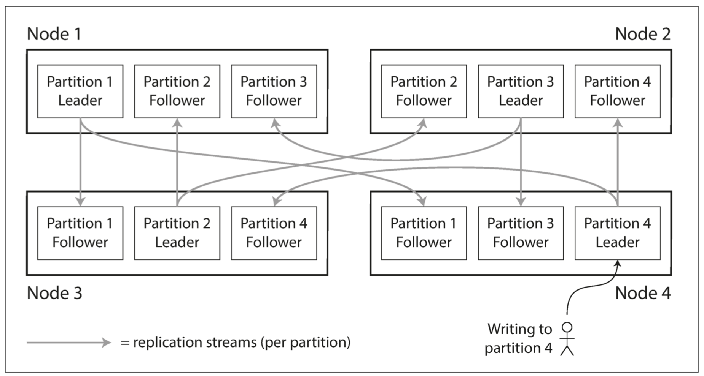
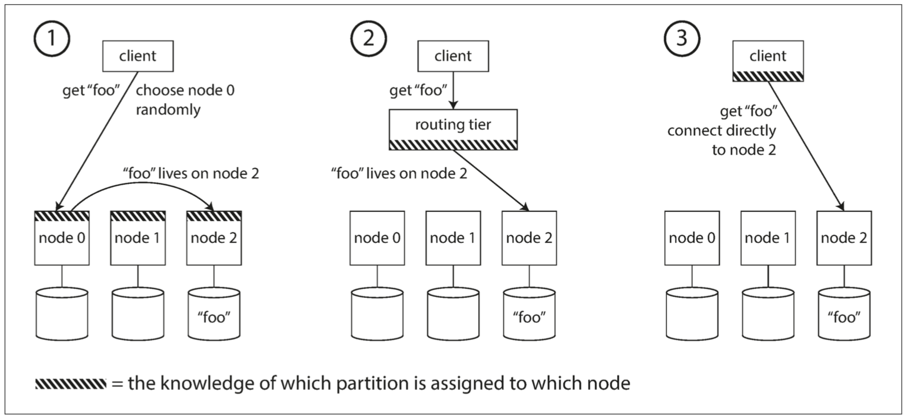
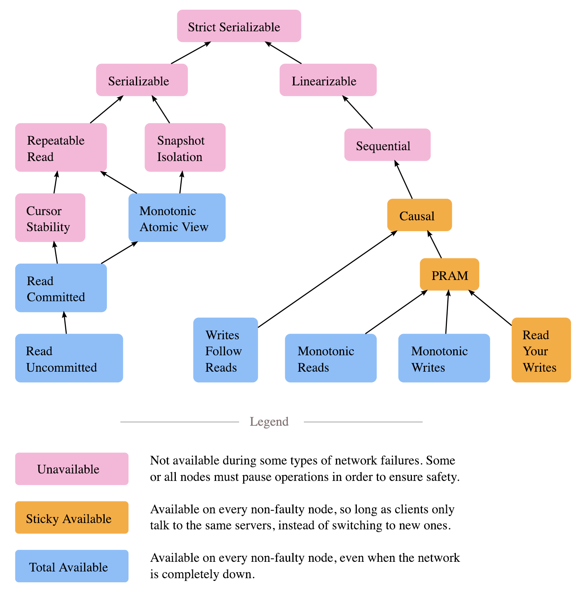

# Programming quotes

This repository holds a list of rules and general remarks about software development. Feel free to contribute.

## Scalability
* Scale comes from simplicity.
* Successful abstractions are the simple ones (e.g. map-reduce)

## Data
* The data always outlives code.
* Programming language–specific encodings are restricted to a single program‐ ming language and often fail to provide forward and backward compatibility.
* Binary schema–driven formats like Thrift, Protocol Buffers, and Avro allow compact, efficient encoding with clearly defined forward and backward compati‐ bility semantics. The schemas can be useful for documentation and code genera‐ tion in statically typed languages. However, they have the downside that data needs to be decoded before it is human-readable.

## Distributed systems
* In most distributed database systems different partitions operate independently, so there is no global ordering of writes - when the users reads from the database, they may see some parts of the database in an older state and some in a newer state.
* Pretending that replication is synchronous when in fact it is asynchronous is a recipe for problems down the line.
* There are ways in which an application can provide a stronger guarantee than the underlying database—for example, by performing certain kinds of reads on the leader. However, dealing with these issues in application code is com‐ plex and easy to get wrong.
* Multi-leader replication is often considered dangerous territory that should be avoided if possible.
* Many implementations of multi-leader replication handle conflicts quite poorly which is why conflict avoidance is recommended.
* Every replication scheme must ensure that the data is eventually the same in all replicas. Even if some systems cause some writes to be lost in the process (LWW in Cassandra)
* Although quorums appear to guarantee that a read returns the latest written value, in practice it is not so simple. The parameters w and r allow you to adjust the probability of stale values being read, but it’s wise to not take them as absolute guarantees. You usually do not get the guarantees like reading your writes, monotonic reads, or consistent prefix reads and those stronger guarantees generally require transactions or consensus.
* In replicated data systems, in order to become eventually consistent, the replicas should converge toward the same value. How do they do that? One might hope that replicated databases would handle this automatically, but unfortunately most implementations are quite poor: if you want to avoid losing data, you—the application developer—need to know a lot about the internals of your database’s conflict handling.
* Last Write Wins conflict resolution strategy achieves eventual convergence at the cost of reduced durability - it silently discards successful write which each might not have been concurrent in the first place! There are some situations, such as caching, in which lost writes are perhaps acceptable. If losing data is not acceptable, LWW is a poor choice for conflict resolution. The only safe way of using a database with LWW is to ensure that a key is only writ‐ ten once and thereafter treated as immutable, thus avoiding any concurrent updates to the same key. For example, a recommended way of using Cassandra is to use a UUID as the key, thus giving each write operation a unique key.

## Design

* Design your data model for the sake of your domain model, not your domain model for the sake of your data model.
* Constraints enforce elegant design and can give rise to its better properties. The more constraints the more one frees one's self.
* Having a language that allows you to do anything is not an advantage, it is a liability. You have to find the heart and essence and build on top of that.
* Software is built not like architecture. In architecture you can or build buildings from smaller buildings. In software you create software from smaller software and there are no boundaries. This is why the simple ideas are so important - they can bubble up to the top level of the design. Best example might be map reduce. Building architecture has natural scale - a human being. It is designed for a human scale and this is why it impresses us. For software there is no such thing. A human brain may be a limit - can we fit the idea in our brain? Having too much stuff in your brains slows you down and makes you prone to errors.
* Simple ideas are actually much more likely to be used because of adoption and being able to grow. Simple ideas must fit inside your brain. Html can be one example. 
* We are far to easily impressed and imprisoned by the concept of size. Idolatry of giantism. Smallness has virtues we should insist on. We should not assume growth without bounds. Economy of scale so much engrained in us but does not apply in software. It does not get cheaper with size.
* How much work does the developers do on things accidental as opposed to essential? Look at how many people work on this code, it has to be special! 
* In software there is a diseconomy of scale the more people you have the more problems you will get - cargo cult programming
* All code is technical debt, some just have more interest rate
* Dead code may be not so dead at some point and be zombie causing trouble
* Architecture is like garden not a city. You can grow things but you have to cut other things down 

## Reliability

* The major difference between a thing that might go wrong and a thing that cannot possibly go wrong is that when a thing that cannot possibly go wrong goes wrong it usually turns out to be impossible to get at or repair.

## Data availability

* Replication - keeping several copies of data on different nodes - can serve several purposes:
  * _High availability_ - keeping the system running, even when one machine (or several machines, or an entire datacenter) goes down
  * _Disconnected operation_ - allowing an application to continue working when there is a network interruption
  * _Lower Latency_ - placing data geographically close to users, so that users can interact with it faster
  * _Scalability_ - being able to handle a higher volume of reads than a single machine could handle, by performing reads on replicas
* Replication is a complicated problem. There are three approaches to replication, each with it's own benefits and shortcomings
  * _Single-leader replication_ - clients send all writes to a single node (the leader), which sends a stream of data change events to the other replicas (followers). Reads can be performed on any replica, but reads from followers might be stale.
  * _Multi-leader replication_ - clients send each write to one of several leader nodes, any of which can accept writes. The leaders send streams of data change events to each other and to any follower nodes.
  * _Leaderless replication_ - clients send each write to several nodes, and read from several nodes in parallel in order to detect and correct nodes with stale data.
  
  Each approach has advantages and disadvantages. Single-leader replication is popular because it is fairly easy to understand and there is no conflict resolution to worry about. Multi-leader and leaderless replication can be more robust in the presence of faulty nodes, network interruptions, and latency spikes - at the cost of being harder to reason about and providing only very weak consistency guarantees.

* Replication can be synchronous or asynchronous, which has a profound effect on the system behavior when there is a fault. Although asynchronous replication can be fast when the system is running smoothly, it’s important to figure out what happens when replication lag increases and servers fail. If a leader fails and you promote an asynchronously updated follower to be the new leader, recently committed data may be lost.
  
* There are a few consistency models which are helpful for deciding how an application should behave under replication lag:
  * Read-after-write consistency - users should always see data that they submitted themselves.
  * Monotonic reads - after users have seen the data at one point in time, they shouldn’t later see the data from some earlier point in time.
  * Consistent prefix reads - users should see the data in a state that makes causal sense: for example, seeing a question and its reply in the correct order.

## Data scalability

* For a very large datasets, or a very high write throughput, replication is not sufficient alone - one needs to use partitioning (sharding). Normally, partitions are defined in such a way that each piece of data (each record, row, or document) belongs to exactly one partition.
  
* The goal of partitioning is to spread the data and query load evenly across multiple machines, avoiding hot spots (nodes with disproportionately high load). This requires choosing a partitioning scheme that is appropriate to your data, and rebalancing the partitions when nodes are added to or removed from the cluster. Each partition is a small database of its own (separate), although the database may support operations that touch multiple partitions at the same time. While data replication serves a purpose of increased availability (plus some performance benefit), the main reason for wanting to partition data is scalability. Different partitions can be placed on different nodes in a shared-nothing cluster. Thus, a large dataset can be distributed across many disks, and the query load can be distributed across many processors.

* For queries that operate on a single partition, each node can independently execute the queries for its own partition, so query throughput can be scaled by adding more nodes. Large, complex queries can potentially be parallelized across many nodes, although this gets significantly harder.

* Partitioning is usually combined with replication so that copies of each partition are stored on multiple nodes. This means that, even though each record belongs to exactly one partition, it may still be stored on several different nodes for fault tolerance.
  
The choice of partitioning scheme is mostly independent of the choice of replication scheme.

* There are two main approaches to partitioning:
  * _Key range partitioning_, where keys are sorted, and a partition owns all the keys from some minimum up to some maximum. Sorting has the advantage that effi‐ cient range queries are possible, but there is a risk of hot spots if the application often accesses keys that are close together in the sorted order. In this approach, partitions are typically rebalanced dynamically by splitting the range into two subranges when a partition gets too big.
  * _Hash partitioning_, where a hash function is applied to each key, and a partition owns a range of hashes. This method destroys the ordering of keys, making range queries inefficient, but may distribute load more evenly. When partitioning by hash, it is common to create a fixed number of partitions in advance, to assign several partitions to each node, and to move entire parti‐ tions from one node to another when nodes are added or removed. Dynamic partitioning can also be used.

  Hybrid approaches are also possible, for example with a compound key: using one part of the key to identify the partition and another part for the sort order.

* A secondary index also needs to be partitioned, and there are two methods:
  * Document-partitioned indexes (local indexes), where the secondary indexes are stored in the same partition as the primary key and value. This means that only a single partition needs to be updated on write, but a read of the secondary index requires a scatter/gather across all partitions.
  * Term-partitioned indexes (global indexes), where the secondary indexes are parti‐ tioned separately, using the indexed values. An entry in the secondary index may include records from all partitions of the primary key. When a document is writ‐ ten, several partitions of the secondary index need to be updated; however, a read can be served from a single partition.

* Even if you query the partitions in parallel, scatter/gather is prone to tail latency amplification.

* Rebalancing is a process of tidying up the cluser in order to (re)distribute the data evenly accross existing and new cluser nodes. It might be necessary if:
  * The query throughput increases, so you want to add more CPUs to handle the load.
  * The dataset size increases, so you want to add more disks and RAM to store it.
  * A machine fails, and other machines need to take over the failed machine’s responsibilities.
No matter which partitioning scheme is used, rebalancing is usually expected to meet some minimum requirements:
  * After rebalancing, the load (data storage, read and write requests) should be shared fairly between the nodes in the cluster.
  * While rebalancing is happening, the database should continue accepting reads and writes.
  * No more data than necessary should be moved between nodes, to make rebalanc‐ ing fast and to minimize the network and disk I/O load.
  
* Rebalancing strategies are
  * _Hash mod N_ (don't do it) - this means that modifying the node count would cause all keys to be moved to different partitions.
  * _Fixed number of partitions_ - assigment of keys to partitions does not change so when adding a new node we must move only the keys beloging to the partitions we need to move to the new node (or distribute accross remaining nodes if node is removed). You have to pick the right number of partitions (accomodating the future growth) in advance as resizing partitions is either not supported or complicated. If partitions are very large, rebalancing and recovery from node failures become expensive. But if par‐ titions are too small, they incur too much overhead. The best performance is achieved when the size of partitions is “just right,” neither too big nor too small, which can be hard to achieve if the number of partitions is fixed but the dataset size varies.
  * _Dynamic partitioning_ - the number of partitions is proportional to the size of the dataset. Especially useful for key-range partitioning backed data systems.
  * _Partitioning proportionally to nodes_ - make the number of partitions proportional to the number of nodes. In other words the size of each partition grows proportionally to the dataset size while the number of nodes remains unchanged, but when you increase the number of nodes, the partitions become smaller again. Since a larger data volume generally requires a larger number of nodes to store, this approach also keeps the size of each partition fairly stable. Available only in hash-based partitioning.

* There are three basic options for a client to know which node to talk to to fetch data given some rebalancing technique is in place:
  * Allow clients to contact any node (e.g., via a round-robin load balancer). If that node coincidentally owns the partition to which the request applies, it can handle the request directly; otherwise, it forwards the request to the appropriate node, receives the reply, and passes the reply along to the client.
  * Send all requests from clients to a routing tier first, which determines the node that should handle each request and forwards it accordingly. This routing tier does not itself handle any requests; it only acts as a partition-aware load balancer. (most common)
  * Require that clients be aware of the partitioning and the assignment of partitions to nodes. In this case, a client can connect directly to the appropriate node, without any intermediary.

  

* It is very common that data systems use coordination services like Zookeeper to store partition assignments and make it notify routing tier about partition ownership changes.

## Concurrency

* An operation A happens before another operation B if B knows about A, or depends on A, or builds upon A in some way. Whether one operation happens before another operation is the key to defining what concurrency means. In fact, we can simply say that two operations are concurrent if neither happens before the other (i.e., neither knows about the other). Thus, whenever you have two operations A and B, there are three possibilities: either A happened before B, or B happened before A, or A and B are concurrent. What we need is an algorithm to tell us whether two operations are concurrent or not. If one operation happened before another, the later operation should overwrite the earlier operation, but if the operations are concurrent, we have a conflict that needs to be resolved. It may seem that two operations should be called concurrent if they occur “at the same time”—but in fact, it is not important whether they literally overlap in time. Because of problems with clocks in distributed systems, it is actually quite difficult to tell whether two things happened at exactly the same time. In computer systems, two operations might be concurrent even though the speed of light would in principle have allowed one operation to affect the other. For example, if the network was slow or interrupted at the time, two operations can occur some time apart and still be concurrent, because the network problems prevented one operation from being able to know about the other.

## Consistency models



* Abortability seems like a better description of what atomicity stands for in ACID acronym.
* If the writes are grouped together into an atomic transaction, and the transaction cannot be completed (committed) due to a fault, then the transaction is aborted and the database must discard or undo any writes it has made so far in that transaction.
* The idea of ACID consistency is that you have certain statements about your data (invariants) that must always be true—for example, in an accounting system, credits and debits across all accounts must always be balanced. If a transaction starts with a database that is valid according to these invariants, and any writes during the transac‐ tion preserve the validity, then you can be sure that the invariants are always satisfied.
* Atomicity, isolation, and durability are properties of the database, whereas consis‐ tency (in the ACID sense) is a property of the application. The application may rely on the database’s atomicity and isolation properties in order to achieve consistency, but it’s not up to the database alone. Thus, the letter C doesn’t really belong in ACID.
* Isolation in the sense of ACID means that concurrently executing transactions are isolated from each other: they cannot step on each other’s toes. The classic database textbooks formalize isolation as serializability, which means that each transaction can pretend that it is the only transaction running on the entire database. In partice serializability is almost never even implemented due to performance penalties - snapshot isolation is used instead (a weaker guarantee).
* Durability is the promise that once a transaction has com‐ mitted successfully, any data it has written will not be forgotten, even if there is a hardware fault or the database crashes.
* In ACID, atomicity and isolation describe what the database should do if a client makes several writes within the same transaction, which includes multiple database objects (multi-object transactions).
* Atomicity and isolation also apply when a single object is being changed. Storage engines almost universally aim to provide atomicity and isolation on the level of a single object (such as a key-value pair) on one node. Atomicity can be implemented using a log for crash recovery, and isolation can be implemented using a lock on each object (allowing only one thread to access an object at any one time).
* Some databases also provide more complex atomic operations,iv such as an increment operation, which removes the need for a read-modify-write cycle. Similarly popular is a compare-and-set operation, which allows a write to happen only if the value has not been concurrently changed by someone else.
* Compare-and-set and other single-object operations have been dubbed “light‐ weight transactions” or even “ACID” for marketing purposes, but that terminology is misleading. A transaction is usually understood as a mechanism for grouping multiple operations on multiple objects into one unit of execution.
* Many distributed datastores have abandoned multi-object transactions because they are difficult to implement across partitions, and they can get in the way in some scenarios where very high availability or performance is required. However, there is nothing that fundamentally prevents transactions in a distributed database.
* Applications can still be implemented without transactions. However, error handling becomes much more complicated without atomicity, and the lack of isolation can cause concurrency problems.
* Datastores with leaderless replication work much more on a “best effort” basis, which could be summarized as “the database will do as much as it can, and if it runs into an error, it won’t undo something it has already done”—so it’s the application’s responsibility to recover from errors. Errors will inevitably happen, but many software developers prefer to think only about the happy path rather than the intricacies of error handling.
* Serializability means that transactions appear to have occurred in some total order. A transaction’s sub-operations do not appear to interleave with sub-operations from other transactions. As opposed to linearazibility, it is a multi-object property. Serializability is both a strong property but also a weak property. Weak in a sense that it does not require a per-process order between transactions. A process can observe a write, then fail to observe that same write in a subsequent transaction. In fact, a process can fail to observe its own prior writes, if those writes occurred in different transactions.
* Strict serializability implies serializability and linearizability. It means that transaction A precedes transaction B if A completes before B begins - this is the real-time constraint from linearizability. You can think of strict serializability as serializability’s total order of transactional multi-object operations, plus linearizability’s real-time constraints. Alternatively, you can think of a strict serializable database as a linearizable object in which the object’s state is the entire database.
* Unlike serializability, which enforces a total order of transactions, snapshot isolation only forces a partial order: sub-operations in one transaction may interleave with those from other transactions. The most notable phenomena allowed by snapshot isolation are write skews, which allow transactions to read overlapping state, modify disjoint sets of objects, then commit; and a read-only transaction anomaly, involving partially disjoint write sets.
* What are read skews? What are write skews?

## Databases

* Nobody really knows what repeatable read is - every database sees if differently.
* **The lost update problem** can occur if an application reads some value from the database, modifies it, and writes back the modified value (a read-modify-write cycle). If two transactions do this concurrently, one of the modifications can be lost, because the second write does not include the first modification. Examples are:
  * Incrementing a counter
  * Updating an account balance
  * Making a local change to a complex value
  * Two users editing a wiki page at the same time

  Because this is such a common problem, a variety of solutions have been developed
  * _Atomic write operations_ - remove the need to implement read-modify-write cycles in application code, usually the best solution if we can live with them (if the operation is more complex - that is we need to apply complex logic checking if the operation can happen in the first place). Atomic operations are usually implemented by taking an exclusive lock on the object when it is read so that no other transaction can read it until the update has been applied.
  * _Explicit locking_ - selects for update. This works, but to get it right, you need to carefully think about your application logic. It’s easy to forget to add a necessary lock somewhere in the code, and thus introduce a race condition. Unfortunately, object-relational mapping frameworks make it easy to accidentally write code that performs unsafe read-modify-write cycles instead of using atomic operations provided by the database
  * _Automatically detecting lost updates_ - implemented in some databases (like Postgres repeatable read) - definitely the best option if available, removes the complexity of handling that. Aborts transaction which would cause the update to be lost. Application can then retry.
  * _Compare-and-set_ - very frequent in databases that don’t provide transactions, avoids lost updates by allowing an update to happen only if the value has not changed since you last read it.
  
  This is even more advanced problem in replciated databases. Since they have copies of the data on multiple nodes, and the data can potentially be modified concurrently on different nodes, some additional steps need to be taken to prevent lost updates. A common approach in such replicated databases is to allow concurrent writes to create several conflicting versions of a value (also known as siblings), and to use application code or special data structures to resolve and merge these versions after the fact.

* **Read skew** (or **nonrepeatable read**) is a phenomena in which within transaction we read a database object in one state and in the next read we find it in a different state. This complies with read committed isolation level. It is not a lasting problem, because she will most likely see consis‐ tent account balances if she reloads the online banking website a few seconds later. However, some situations cannot tolerate such temporary inconsistency - analitycal queries and database backups. Snapshot isolation prevents that. 

* **Dirty writes** and **lost updates** are two kinds of race conditions that can occur when different transactions concurrently try to write to the same objects.
* **Write skew** is a tricky problem - it is neither a dirty write nor a lost update, because the two transactions are updating two different objects. It is less obvious that a conflict occurred here, but it’s definitely a race condition (this happens for concurrent transactions only). Write skew can occur if two transactions read the same objects, and then update some of those objects (different transactions may update different objects). In the special case where different transactions update the same object, you get a dirty write or lost update anomaly (depending on the timing). Harder to fight - one option is to use range-locks. In case the range is big (like time) need explicit - materialized - database objects to lock on.

* An effect, where a write in one transaction changes the result of a search query in another transaction, is called a phantom. Snapshot isolation avoids phantoms in read-only queries, but in read-write transactions like the examples we discussed, phantoms can lead to particularly tricky cases of write skew.

* **Serializable isolation** is usually regarded as the strongest isolation level. It guarantees that even though transactions may execute in parallel, the end result is the same as if they had executed one at a time, serially, without any concurrency. Thus, the database guarantees that if the transactions behave correctly when run individually, they continue to be correct when run concurrently - in other words, the database prevents all possible race conditions.

* Serial execution of transactions has become a viable way of achieving serializable isolation within certain constraints:
  * Every transaction must be small and fast, because it takes only one slow transac‐ tion to stall all transaction processing.
  * It is limited to use cases where the active dataset can fit in memory. Rarely accessed data could potentially be moved to disk, but if it needed to be accessed in a single-threaded transaction, the system would get very slow.
  * They don’t allow interactive multi-statement transactions. Instead, the application must submit the entire transaction code to the database ahead of time. 
  * Write throughput must be low enough to be handled on a single CPU core, or else transactions need to be partitioned without requiring cross-partition coordi‐ nation.
  * Cross-partition transactions are possible, but there is a hard limit to the extent to which they can be used.
  
  A system designed for single-threaded execution (to satisfy serializability) can sometimes perform better than a system that supports concurrency, because it can avoid the coordination overhead of locking. 

* In **two-phase locking**, writers don’t just block other writers; they also block readers and vice versa. Snapshot isolation has the mantra readers never block writers, and writers never block readers, which captures this key difference between snapshot isolation and two-phase locking. On the other hand, because 2PL provides serializability, it protects against all the race conditions, including lost updates and write skew. 

  The blocking of readers and writers is implemented by a having a lock on each object in the database. The lock can either be in shared mode or in exclusive mode. The lock is used as follows:
    * If a transaction wants to read an object, it must first acquire the lock in shared mode. Several transactions are allowed to hold the lock in shared mode simulta‐ neously, but if another transaction already has an exclusive lock on the object, these transactions must wait.
    * If a transaction wants to write to an object, it must first acquire the lock in exclu‐ sive mode. No other transaction may hold the lock at the same time (either in shared or in exclusive mode), so if there is any existing lock on the object, the transaction must wait.
    * If a transaction first reads and then writes an object, it may upgrade its shared lock to an exclusive lock. The upgrade works the same as getting an exclusive lock directly.
    * After a transaction has acquired the lock, it must continue to hold the lock until the end of the transaction (commit or abort). This is where the name “two- phase” comes from: the first phase (while the transaction is executing) is when the locks are acquired, and the second phase (at the end of the transaction) is when all the locks are released.
  
  It may take just one slow transaction, or one transaction that accesses a lot of data and acquires many locks, to cause the rest of the system to grind to a halt.

* **Predicate lock** works similarly to the shared/exclusive lock described earlier, but rather than belonging to a particular object (e.g., one row in a table), it belongs to all objects that match some search condition, such as:

  ``` bash
  SELECT * FROM bookings WHERE room_id = 123 AND
  end_time > '2018-01-01 12:00' AND start_time < '2018-01-01 13:00';
  ```

  The key idea here is that a predicate lock applies even to objects that do not yet exist in the database, but which might be added in the future (phantoms). If two-phase locking includes predicate locks, the database prevents all forms of write skew and other race conditions, and so its isolation becomes serializable. Unfortunately, predicate locks do not perform well: if there are many locks by active transactions, checking for matching locks becomes time-consuming.

* **Index-range locks** are a good alternative to predicate locks as they approximate the locking on an index. It’s safe to simplify a predicate by making it match a greater set of objects. If you have a predicate lock for bookings of room 123 between noon and 1 p.m., you can approximate it by locking bookings for room 123 at any time, or you can approximate it by locking all rooms (not just room 123) between noon and 1 p.m. This provides effective protection against phantoms and write skew. Index-range locks are not as precise as predicate locks would be (they may lock a bigger range of objects than is strictly necessary to maintain serializability), but since they have much lower overheads, they are a good compromise.

* **Pessimistic versus optimistic concurrency control**

## Data types

There are three main methods of representing data which developers are likely to encounter: abstract data types, algebraic data types, and objects. 


### Types

1. **Abstract Data Types**: representing data opaquely
2. **Objects**: representing data through composable interfaces
3. **Algebracic Data Types**: represent data as a composable, concrete structure

### Comparison

Abstract data types are easily extensible in terms of operations, but not in terms of representations, while objects are easily extensible in terms of representations, but not in terms of operations. This tradeoff of operational extensibility versus representational extensibility is known as “the expression problem”. 

Abstract data types and objects both provide data abstraction. This means that, from the perspective of a user consuming them, data is defined in terms of “what can be done with this data” rather than “what structure this data has.” For abstract data types, this abstraction is achieved by implementing a structure for data internally, and hiding this structure from users. For objects, no consistent structure exists, and data is represented as the composition of the behaviors which appear on the object’s interface.

This fundamental distinction leads to a number of tradeoffs. Abstract data types are much easier to optimize than objects, but are impossible to extend without access to their internal implementation.

The two concepts are complementary, and one’s strength tends to be the other’s weakness.

Algebraic data types are different. The reason these types are called “algebraic” is that we can create new types by taking the “sum” or “product” of existing types, just like we can make new terms of an equation by adding or multiplying existing terms in standard high-school algebra. There’s no limit to the composition of algebraic data types. Most typed functional languages provide a special feature to do this (pattern matching).

```bash
type Fruit = Apple | Blackberry;
```

This is very different from abstract data types and objects, which both provide a small set of functions for operating on data while hiding that data’s internal structure. Algebraic types have the opposite intent: they provide a structure for data, to enable any number of functions to be written which work with that data.

A major benefit of algebraic data types is that the structure of algorithms which work on them tends to mirror the structure of the types themselves. For instance when an algebraic data type is recursive, functions consuming it tend to be recursive. Algebraic data types can thus provide developers with guard rails when combined with a type checker, guiding the implementation of algorithms and ensuring that all possibilities are considered at each step. One important characteristic of algebraic data types is that they should always be immutable. Our functions are tightly coupled to the data which they run on. This is the cost of the guarantees and guidance that having an exhaustive list of possibilities gives us.

The tradeoffs provided by algebraic data types are very similar to those provided by abstract data types; both are extensible operationally but not representationally. In fact, every algebraic data type can be trivially used as an abstract data type.

## Other

* Software becomes an artifact of group intelligence. A design must be organized according to the structure of communication within the organization like convey law states.
* Amdahl law states how much time will we need to develop a system one developer could deliver in t1 having n people. How much can you do in parallel? Do people wait for each other work? There is also a cost in communication!
* “When you find yourself in a hole, the first thing to do is stop digging.”

